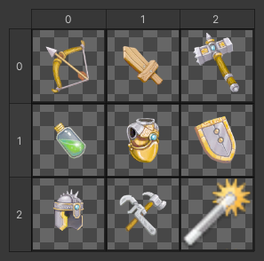



# Changing How TableMatrix Cells Are Drawn

If you want to change how the [TwoDimensionalArrayDrawer] draws its cells you have 
to add the [TableMatrix] attribute to the field and supply a method name to
the *DrawElementMethod* parameter of the [TableMatrix] Attribute. This method name gets resolved using [ActionResolvers]
and will be called for each cell. Inside of this function you use normal Unity GUI
functions or Odin's GUI functions to draw the cell's contents. Odin can pass a few arguments to the provided function
via [NamedValues], these are the possible arguments:

| Name    | Type     |
| ------- | -------- |
| rect    | [Rect]   |
| element | TElement |
| value   | TElement |
| array   | TArray   |
| x       | [int]    |
| y       | [int]    |

```CSharp
public class SomeMonoBehaviour : SerializedMonoBehaviour
{   
    [TableMatrix(DrawElementMethod = nameof(DrawElement))]
    public GameObject[,] SomeTwoDimensionalArray = new GameObject[3, 3];

    private GameObject DrawElement(Rect rect, GameObject value)
    {
        // Draw your cell content here
        // [...]

        return value;
    }  
}
```

---


Here is a small complete example that shows how you could change the preview
texture that Odin draws for your class inside the [TwoDimensionalArrayDrawer].

=== "SomeMonoBehaviour.cs"
    ```CSharp
    using Sirenix.OdinInspector;
    using Sirenix.Utilities.Editor;
    using UnityEngine;

    public class SomeMonoBehaviour : SerializedMonoBehaviour
    {
        [TableMatrix(DrawElementMethod = nameof(DrawElement), SquareCells = true)]
        public Item[,] Items = new Item[3, 3];

        private Item DrawElement(Rect rect, Item value)
        {
            return (Item)SirenixEditorFields.UnityPreviewObjectField(
                rect: rect,
                value: value,
                texture: value?.Preview, // We provide a custom preview texture
                type: typeof(Item)
            );
        } 
    }
    ```

=== "Item.cs"
    ```CSharp
    using UnityEngine;

    [CreateAssetMenu]
    public class Item : ScriptableObject
    {
        public string Name;
        public string Description;
        public Texture2D Preview;
    }
    ```

---

=== "Default"
    


=== "Custom"
    