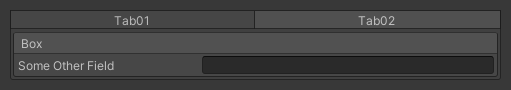
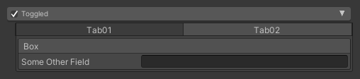



# Nesting Groups
This tutorial demonstrates how to nest Odin's [Group Attributes]. 
We will learn how group paths work and how to handle special cases like the [TabGroup] attribute. 
I'm also going to provide a few examples of varying complexity.


??? info "Group Paths"
    Understanding Odin's group paths are the key to mastering nesting all groups 
    in pretty much every combination imaginable. Odin uses group paths to decide 
    how groups get nested because the order in which attributes are specified in 
    C# is not guaranteed and therefore can't reliably be used to group elements 
    on its own (see [Attribute Specification]). 
    
    Let's begin by creating our first group.

    === "SomeMonoBehaviour.cs"
    ```CSharp
    [BoxGroup("Box")]
    public string SomeField;
    ```
    We added a [BoxGroup] attribute to our field and passed it to the string `#!CSharp "Box"`. 
    Let's have a look at the [BoxGroup] constructor and see what this string is used for.

    === "BoxGroup - Constructor"
    ```CSharp
    public BoxGroupAttribute(
        string group, bool showLabel = true, bool centerLabel = false, float order = 0f)
            : base(group, order)
        {
            ShowLabel = showLabel;
            CenterLabel = centerLabel;
        }
    ```

    As we can see the [BoxGroup] attribute takes a few arguments, but we'll just focus on the
    `#!CSharp string group` parameter for now. We can see that the constructor's body
    doesn't do anything with this value and instead passes it to the base constructor.
    Let's have a look at that.

    === "PropertyGroupAttribute - Base Constructor"
    ```CSharp
    public PropertyGroupAttribute(string groupId, float order)
    {
        GroupID = groupId;
        [...]
    }
    ```

    There we have it! The string we pass is used as the group's identifier and we will
    use it to refer to this group when we want to nest it with other groups.
    Let's test this knowledge and nest a [FoldoutGroup] inside the [BoxGroup] we created earlier.
    Groups are nested like folder paths so the only thing we need to do is to

    1. Add the group attribute
    2. Write the first folders name/identifier
    3. Add a `/`
    4. Write the second "folders" name/identifier

    === "SomeMonoBehaviour.cs"
    ```CSharp
    [BoxGroup("Box")]
    [FoldoutGroup("Box/Foldout")]
    public string SomeField;
    ```

    The final folder hierarchy now looks like this:

    ```
    📁 Box
    └─ 📁 Foldout
    ```

    We can see that we have a [BoxGroup] which has a [FoldoutGroup] inside of it.
    This is the main benefit of visualizing it like a folder hierarchy, but it also shows
    that for a group to be nested inside another one, it must first be separately created.
    Imagine that we didn't declare the [BoxGroup] our code would look like this:

    === "SomeMonoBehaviour.cs"
    ```CSharp
    [FoldoutGroup("Box/Foldout")]
    public string SomeField;
    ```
    We're trying to create a Foldout "folder" inside a Box "folder", but we didn't
    create the Box "folder" so we can't put anything inside of it.

    ```
    ❌ Box
    └─ 📁 Foldout
    ```

    You do not have to write the [BoxGroup] attribute before the [FoldoutGroup]. It just
    needs to exist inside the file. Since as we've discussed in the beginning, order doesn't matter for attributes. So this still works:

    === "SomeMonoBehaviour.cs"
        ```CSharp
        [FoldoutGroup("Box/Foldout")]
        [BoxGroup("Box")]
        public string SomeField;
        ```

    These principles apply to all groups and can theoretically be nested as much as you want.
    We add another group attribute and pass it the full path of identifiers as if it were a folder path.
    The only group that behaves slightly differently is the [TabGroup], which we will look at next.


??? info "TabGroups are (not) special"
    How to nest [TabGroups] is probably the most asked question when it comes to nesting groups.
    We will soon see that it's easier than you might think. Let's start with an example of how
    most people instinctively try to nest a [TabGroup] and see why that doesn't work.

    === "SomeMonoBehaviour.cs"
        ```CSharp
        [TabGroup("MyTabs")]
        [BoxGroup("MyTabs/Box")]
        public string SomeField;
        ```

    Based on our knowledge about group paths, this should work, so what is going on here? Let's investigate a bit and look at the [TabGroups] constructors to get a better understanding.

    === "First TabGroup - Constructor"
        ```CSharp
        public TabGroupAttribute(
            string tab, bool useFixedHeight = false, float order = 0f)
                : this("_DefaultTabGroup", tab, useFixedHeight, order) { }
        ```

    === "Second TabGroup - Constructor"
        ```CSharp
        public TabGroupAttribute(
            string group, string tab, bool useFixedHeight = false, float order = 0f)
                : base(group, order) { }
        ```

    The first thing that we've found out is that the [TabGroup] has two
    constructors. We're using the first one in our example since it's the only one
    that has only one non-optional parameter `#!CSharp string tab`. Judging by the names we can see that 
    we're passing the tab name and not the group identifier. This explains why it's not working,
    but how does Odin identify the group if we don't specify one ourselves? The answer is simple,
    Odin calls the second constructor and assigns `#!CSharp "_DefaultTabGroup"` as the group identifier.

    Now you're maybe thinking "I just have to change my identifier to `#!CSharp "_DefaultTabGroup"` and I'm good to go".
    Unfortunately, this is still not the solution. The [TabGroups] identifier consists of the group identifier
    and the tab name and if we think about it, it makes sense. How else could Odin know in what tab you want to
    put your nested groups? We can now build our group path successfully by

    1. Writing `#!CSharp "_DefaultTabGroup"`
    2. Adding a `\`
    3. Writin the tab name

    === "SomeMonoBehaviour.cs"
    ```CSharp
    // I changed the name to 'Tab01' instead of MyTabs 
    // since we now know that this is actually the tab name.
    [TabGroup("Tab01")]
    [BoxGroup("_DefaultTabGroup/Tab01/Box")]
    public string SomeField;
    ```

    We now have a working [TabGroup] nesting example, but it's still not ideal.
    I know, I know, but we're almost there. Using this method has several drawbacks.

    1. `#!CSharp "_DefaultTabGroup"` is hard to read.
    2. `#!CSharp "_DefaultTabGroup"` seems to magically exist without us creating it in the file leading to confusion.
    3. What do we do if we have multiple TabGroups? They would all have the same group identifier leading to undesired and hard to debug behaviour.

    What's the solution? It's quite simple. Instead of letting Odin call the second constructor and passing it the
    `#!CSharp "_DefaultTabGroup"` string, we call it ourselves and pass the group identifier and the tab name at once.
    We can then just substitute the `#!CSharp "_DefaultTabGroup"` string with our group identifier.

    === "SomeMonoBehaviour.cs"
    ```CSharp
    [TabGroup("MyTabGroup", "Tab01")]
    [BoxGroup("MyTabGroup/Tab01/Box")]
    public string SomeField;
    ```

    That's it! You should now be able to nest all of Odin's groups no matter the complexity
    by simply applying the rules you learned. If you're having problems remembering the correct
    syntax just keep the folder analogy in mind.


    ```
    📁 MyTabGroup
    └─ 📁 Tab01
       └─ 📁 Box
    ```

??? example "Examples"

    ??? example "BoxGroups in a BoxGroup"
        ```CSharp
        [BoxGroup("Box")]
        public string SomeField;

        [HorizontalGroup("Box/Horizontal")]
        [BoxGroup("Box/Horizontal/BoxRight")]
        public string SomeOtherField;

        [BoxGroup("Box/Horizontal/BoxLeft")]
        public string AnotherOne;    
        ```
        <p align="center">
        
        </p>


    ??? example "BoxGroup in a ShowIfGroup"
        ```CSharp
        [ShowIfGroup("PossiblyVisibleGroup", Condition = nameof(ShowGroup))]
        [BoxGroup("PossiblyVisibleGroup/Box")]
        public string SomeField;

        public bool ShowGroup;
        ```
        <p align="center">
        
        </p>


    ??? example "BoxGroups in a TabGroup"
        ```CSharp
        [TabGroup("Tabs", "Tab01")]
        [BoxGroup("Tabs/Tab01/Box")]
        public string SomeField;

        [TabGroup("Tabs", "Tab02")]
        [BoxGroup("Tabs/Tab02/Box")]
        public string SomeOtherField;  
        ```
        <p align="center">
        
        </p>
        <p align="center">
        
        </p>


    ??? example "TabGroup in a TabGroup"
        ```CSharp
        [TabGroup("OuterTabGroup", "OuterTab01")]
        [TabGroup("OuterTabGroup/OuterTab01/InnerTabGroup", "InnerTab01")]
        public string SomeField;

        [TabGroup("OuterTabGroup", "OuterTab02")]
        public string SomeOtherField; 
        ```
        <p align="center">
        
        </p>
    

    ??? example "BoxGroup in a TabGroup in a ToggleGroup"
        ```CSharp
        [ToggleGroup("Toggled")]
        public bool Toggled;

        [TabGroup("Toggled/Tabs", "Tab01")]
        public string SomeField;

        [TabGroup("Toggled/Tabs", "Tab02")]
        [BoxGroup("Toggled/Tabs/Tab02/Box")]
        public string SomeOtherField;
        ```
        <p align="center">
        
        </p>


    ??? example "What even...?"
        ```CSharp
        [ToggleGroup("Toggled")]
        public bool Toggled;

        [HorizontalGroup("Toggled/Horizontal")]
        [FoldoutGroup("Toggled/Horizontal/FoldoutRight")]
        [TabGroup("Toggled/Horizontal/FoldoutRight/TabsRight", "Tab01")]
        [BoxGroup("Toggled/Horizontal/FoldoutRight/TabsRight/Tab01/Box")]
        public string SomeField;

        [TabGroup("Toggled/Horizontal/FoldoutRight/TabsRight", "Tab02")]
        [BoxGroup("Toggled/Horizontal/FoldoutRight/TabsRight/Tab02/Box")]
        public string SomeOtherField;

        [FoldoutGroup("Toggled/Horizontal/FoldoutLeft")]
        [TabGroup("Toggled/Horizontal/FoldoutLeft/TabsLeft", "Tab01")]
        [BoxGroup("Toggled/Horizontal/FoldoutLeft/TabsLeft/Tab01/Box")]
        public string AnotherOne;
        
        [TabGroup("Toggled/Horizontal/FoldoutLeft/TabsLeft", "Tab02")]
        [BoxGroup("Toggled/Horizontal/FoldoutLeft/TabsLeft/Tab02/Box")]
        public string YetAnotherOne;
        ``` 
        <p align="center">
        
        </p>


??? bug "Gotchas"
	If you have missing or duplicate elements, make sure to check your group path,
    this is a sign that you did not nest your group correctly.