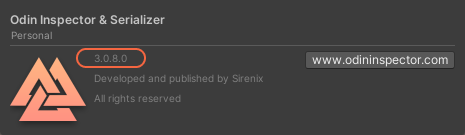

# Missing Features

Unity's package manager sometimes messes up the update which leads to it not actually updating the version and just silently pretending that everything is fine.

Make sure that you're actually on the version you believe to be by navigating to `Tools > OdinInspector > About`.

If it's not showing the expected version number delete Unity's package manager cache and update Odin again. This usually fixes the problem. 
Unity's package manager cache is usually located at: `%appdata%/Unity/Asset Store-5.x` for windows.