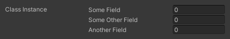



# Remove Unity's Default Foldout


By adding the [InlineProperty] Attribute to the class we can tell Odin to draw the contents of the class inline
meaning no drop-down will be drawn. 

```CSharp
[InlineProperty]
[System.Serializable]
public class SomeClass
{
	public float SomeField;
	public float SomeOtherField;
	public float AnotherField;
}

public SomeClass ClassInstance;
```




By itself, this will leave the label of the field which will indent all fields
contained in the class. Adding the [HideLabel] Attribute removes that label, leaving us with the desired result.

```CSharp
[HideLabel]
[InlineProperty]
[System.Serializable]
public class SomeClass
{
	public float SomeField;
	public float SomeOtherField;
	public float AnotherField;
}

public SomeClass ClassInstance;
```


You can also add these attributes to the `ClassInstance` instead if you only want that specific instance to not have the drop-down.