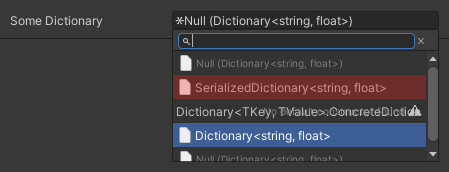

# Serialization Doesn't Work

If you're having issues serializing values follow these steps to remove the most common errors.

1. Remove any serialization attributes from your class.
2. Open the Serialization Debugger inside the inspector. You can find it by opening the Context Menu of the MonoBehaviour / ScriptableObject and clicking on Debug Serialization
3. Follow the steps that the debugger recommends  at the bottom of the debugger window.

If you're trying to serialize a Dictionary and you have issues with it, make sure that you **didn't** select `SerializableDictionary<T1, T2>` from the object reference picker.

